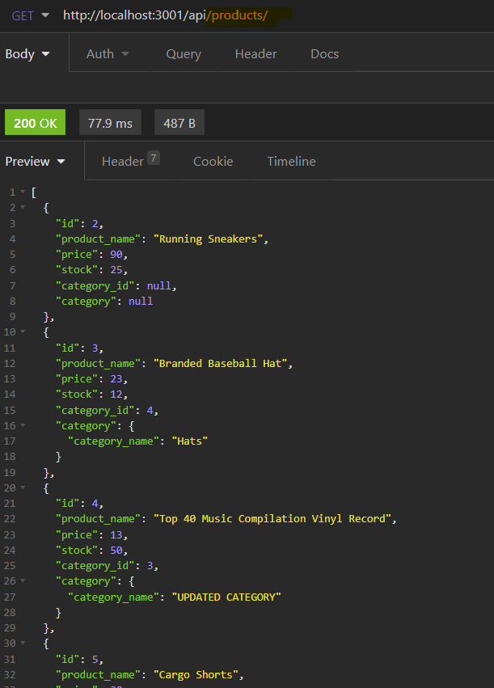
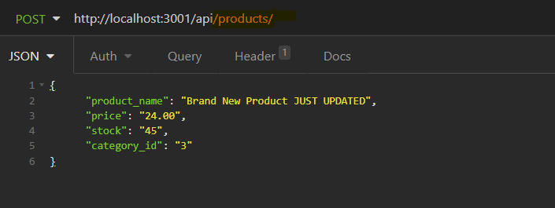
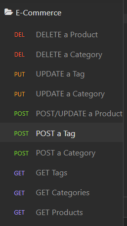

# e-comerce-back-end

## Description

The challange in this application is to build the back end for an e-commerce site. By taking a working Express.js API and configure it to use Sequelize to interact with a MySQL database.

Because this application won’t be deployed. You can find a Demo Video at the end of this ReadMe File

## User Story
AS A manager at an internet retail company
I WANT a back end for my e-commerce website that uses the latest technologies
SO THAT my company can compete with other e-commerce companies
Acceptance Criteria
GIVEN a functional Express.js API
WHEN I add my database name, MySQL username, and MySQL password to an environment variable file
THEN I am able to connect to a database using Sequelize
WHEN I enter schema and seed commands
THEN a development database is created and is seeded with test data
WHEN I enter the command to invoke the application
THEN my server is started and the Sequelize models are synced to the MySQL database
WHEN I open API GET routes in Insomnia for categories, products, or tags
THEN the data for each of these routes is displayed in a formatted JSON
WHEN I test API POST, PUT, and DELETE routes in Insomnia
THEN I am able to successfully create, update, and delete data in my database

## Mock-Up

Example of a GET request

Example of a POST request

Example of a OTHER types of working request

## Links

### Demo Video(s)
1st Part
https://drive.google.com/file/d/1niUkdliYJlfgb42om-IFrkfKAl9RauYk/view (Links to an external site.)

2nd Part
https://drive.google.com/file/d/1ZIUPLhyiWqvdlNFl5eiGGWq-PppsQ6km/view (Links to an external site.)
 

